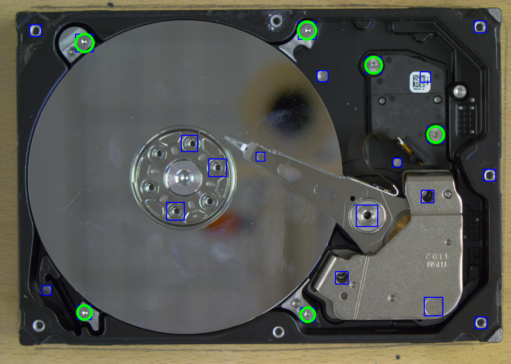

# "DNN-Based Screw Detection for Automated Disassembly Processes"

This is an implementation of Screw Detectoron Python 3, Keras, TensorFlow and ROS. The scheme uses Hough Transform to get the candidates and then runs the integrated model to classify the candidates into screws and artifacts. The integrated model is based on Xception and InceptionV3.

Publicized code for the paper "DNN-Based Screw Detection for Automated Disassembly Processes"

The repository includes:

    - Source code of Screw Detector built on Xception and InceptionV3.
    - Models
    - Dataset

The code is documented and designed to be easy to extend. If you use it in your research, please consider citing this repository (bibtex will be below later on). The dataset was created by using the Screw Detector in the offline mode, which can be triggered once the ROS-Node is up and running. You can use this mode to collect images for your own dataset.

# Contributing

Contributions to this repository are welcome. Examples of things you can contribute:

    - Training on other datasets.
    - Accuracy Improvements.
    - Visualizations and examples.

# Installation

1. Clone this repository
2. Install ROS (tested only on Melodic) from its official website.
3. Install python3, tensorflow-gpu==1.9.0, opencv-python==3.4.3.18 preferably via pip.
3. Download the weights: https://owncloud.gwdg.de/index.php/s/PJIPYTvBteXlqhv (Extract it and change the path in `src/candidate_generator.py` accordingly.
4. Download the dataset (optional): https://owncloud.gwdg.de/index.php/s/iqljlhv5UT38Ne
5. Since the code is ROS-based, you'll need an RGB Camera and its ROS node which publishes RGB images. If you have these two, then you need to modify the following files to get the code working with your own camera:
   - `launch/screw_detection.launch`
   - `src/candidate_generator.py`
6. The command to run: `roslaunch screw_detection screw_detection.launch`

# To be uploaded

- Standalone code.
- Evaluation code.

